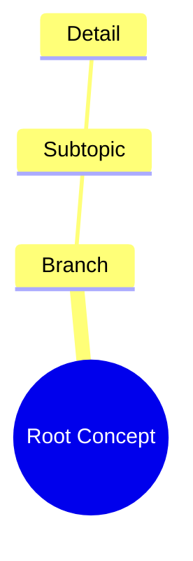

# Exhaustive Learning Map Extractor

Use this skill when the user asks to turn pasted transcripts, lectures, notes, research dumps, meeting transcripts, course material, or long unstructured text into a detailed learning map, mind map, knowledge graph, ontology, study map, Mermaid diagram, JSON hierarchy, or structured outline.

The core mission is **zero-detail-loss transformation**. Do not summarize by default. Do not compress away caveats, examples, side remarks, numbers, definitions, edge cases, contradictions, or minor dependencies. Preserve microscopic detail while reorganizing the material into a navigable learning structure.

## Non-Negotiable Objective

Transform unstructured text into an exhaustive learning map that preserves:

- Every major topic.
- Every subtopic.
- Every definition.
- Every named entity.
- Every date, number, statistic, quantity, version, threshold, and measurement.
- Every example, caveat, exception, warning, limitation, and edge case.
- Every relationship, prerequisite, dependency, cause, effect, contrast, contradiction, sequence, and hierarchy.
- Every repeated concept, merged carefully without losing its repeated source appearances.
- Every user-supplied claim, grounded only in the provided text.

The output should be a **faithful topological transformation**, not a summary.

## When to Use

Invoke this skill when the user says things like:

- “Make a learning map from this.”
- “Turn this transcript into a mind map.”
- “Extract everything from these notes.”
- “Make a Mermaid mindmap.”
- “Make a knowledge graph.”
- “I need a zero-loss map.”
- “Don’t miss any detail.”
- “Make this into a JSON learning map.”
- “Create a full study map from this lecture.”
- “Turn my research into a Claude Skill / map / ontology.”

## Operating Principles

### 1. Preserve Before Beautifying

Accuracy and coverage are more important than elegance. The map may be large. Do not reduce detail just to make it look clean.

### 2. Source-Grounded Only

Never add outside facts unless the user explicitly asks for enrichment. If the transcript is wrong, contradictory, incomplete, or ambiguous, preserve that fact and mark it.

Use source references for terminal details. A source reference may be an exact short quote, section label, line number if available, or local phrase from the transcript.

### 3. No Silent Omission

When space is limited, prefer a hierarchical Markdown outline over a compressed Mermaid diagram. If the input is too large to fully process in one response, produce the first complete section and clearly state what remains to be processed.

### 4. Map, Do Not Summarize

A summary says “what matters most.”
A learning map says “what is there and how it connects.”

### 5. Maintain Chronology and Topology

Track both:
- the order in which the source introduced ideas;
- the conceptual dependency structure between ideas.

## Required Extraction Workflow

Follow this workflow internally before producing the final answer.

### Phase 1: Boundary Setup

Identify the input type:

- transcript
- lecture notes
- research dump
- meeting notes
- tutorial
- article
- code explanation
- mixed material
- unknown

Determine the best output mode from the user request. If unspecified, use this order:

1. Markdown learning map
2. JSON ontology
3. Mermaid mindmap

For very large inputs, start with Markdown because it is the least fragile.

### Phase 2: Macro Structure Pass

Extract the top-level structure:

- root concept
- major branches
- sections or implicit sections
- topic sequence
- primary claims
- main learning objectives
- high-level dependencies

Do not add micro-details yet. Build a skeleton.

### Phase 3: Entity and Definition Pass

Extract all:

- technical terms
- named entities
- tools
- systems
- people
- organizations
- papers
- methods
- acronyms
- definitions
- aliases
- exact phrases that function as labels

Attach each to the most relevant branch.

### Phase 4: Relationship and Dependency Pass

Extract all relationships:

- cause → effect
- prerequisite → dependent concept
- problem → solution
- claim → evidence
- tool → use case
- method → limitation
- concept → example
- comparison / contrast
- contradiction
- sequence / workflow
- parent → child hierarchy

Represent relationships explicitly in the map, not only through proximity.

### Phase 5: Micro-Detail Sweep

Perform a hostile audit for details likely to be missed:

- passing remarks
- side examples
- caveats
- warnings
- “but,” “however,” “unless,” “except,” “only if”
- numerical details
- version names
- edge cases
- anomalies
- constraints
- failure modes
- repeated ideas
- implied dependencies

Add these as terminal nodes or source-grounded annotations.

### Phase 6: Deduplication Without Detail Loss

When the same concept appears multiple times:

- merge into one canonical node;
- preserve all distinct wording, nuance, and source references;
- record repeated appearances as evidence of emphasis;
- do not delete a repeated concept if the repetition adds nuance.

### Phase 7: Verification Pass

Before final output, compare the candidate map against the original input.

Check for:

- omitted numbers
- omitted examples
- omitted caveats
- omitted definitions
- unsupported claims
- hallucinated outside knowledge
- orphan nodes with unclear parents
- duplicate nodes that should be merged
- Mermaid syntax errors if Mermaid is used
- invalid JSON if JSON is used

If any omission is found, patch the map before answering.

## Output Modes

### Mode A: Markdown Learning Map

Use this when:
- the input is long;
- the user wants readability;
- Mermaid would be too fragile;
- the user did not specify a format.

Structure:

```markdown
# Learning Map: [Root Concept]

## Coverage Statement
- Source type:
- Extraction goal:
- Completeness status:
- Notes on ambiguity or missing context:

## 1. [Major Branch]
### 1.1 [Subtopic]
- **Concept:** ...
- **Definition:** ...
- **Details:**
  - ...
  - ...
- **Relationships:**
  - Depends on: ...
  - Leads to: ...
  - Contrasts with: ...
- **Source anchors:**
  - “short exact quote or phrase”
```

Rules:
- Use nested headings and bullets.
- Preserve small details as terminal bullets.
- Use bold labels for definitions, examples, caveats, warnings, and relationships.
- Do not over-polish into a short essay.

### Mode B: JSON Ontology

Use this when the user asks for JSON, structured data, ontology, parser-friendly output, API-ready output, or database import.

Return valid JSON only when explicitly requested. No preamble.

Schema:

```json
{
  "learning_map": {
    "root_concept": "",
    "source_type": "",
    "completeness_status": "complete|partial|requires_more_input",
    "metadata": {
      "extraction_mode": "zero_detail_loss",
      "outside_knowledge_used": false,
      "known_limitations": []
    },
    "branches": [
      {
        "id": "B1",
        "title": "",
        "summary": "",
        "source_anchors": [],
        "subtopics": [
          {
            "id": "B1.S1",
            "title": "",
            "definitions": [],
            "entities": [],
            "details": [
              {
                "detail": "",
                "type": "claim|definition|example|caveat|warning|number|method|relationship|edge_case|quote|other",
                "source_reference": "",
                "relationships": []
              }
            ],
            "micro_details": []
          }
        ]
      }
    ],
    "cross_links": [
      {
        "from": "",
        "to": "",
        "relationship_type": "",
        "source_reference": ""
      }
    ],
    "omission_audit": {
      "numbers_checked": true,
      "examples_checked": true,
      "caveats_checked": true,
      "definitions_checked": true,
      "relationships_checked": true
    }
  }
}
```

JSON rules:
- Escape all quotation marks.
- Do not include comments.
- Do not use trailing commas.
- Every terminal detail should include a source reference when possible.
- Use `outside_knowledge_used: false` unless the user explicitly asked for external enrichment.

### Mode C: Mermaid Mindmap

Use this when the user asks for Mermaid, visual map, mindmap, or GitHub-renderable diagram.

Rules:
- Begin with `mindmap`.
- Use exactly 4 spaces per hierarchy level.
- Keep node labels short enough to render.
- Sanitize special characters.
- Avoid raw quotes inside nodes unless escaped.
- If details are too long, put the full detail in a Markdown section after the diagram.
- Use semantic emoji sparingly to aid navigation.

Template:



If Mermaid becomes too large or fragile, produce:
1. a compact Mermaid overview;
2. a full Markdown exhaustive map below it.

### Mode D: Knowledge Graph Edge List

Use this when the user asks for relationships, graph, nodes and edges, ontology, or dependency graph.

Structure:

```markdown
# Knowledge Graph

## Nodes
| ID | Label | Type | Source Anchor |
|---|---|---|---|

## Edges
| From | Relationship | To | Source Anchor |
|---|---|---|---|
```

Relationship types may include:
- defines
- depends_on
- causes
- prevents
- enables
- contradicts
- exemplifies
- elaborates
- constrains
- compares_with
- part_of
- sequence_before
- sequence_after

## Handling Long Inputs

If the transcript is too long for a fully exhaustive one-response output:

1. Do not pretend the map is complete.
2. Process the material in contiguous sections.
3. Preserve section order.
4. Include a visible progress marker.

Use this status block:

```markdown
## Extraction Status
- Processed: [section / chunk / approximate range]
- Not yet processed: [remaining range]
- Completeness: partial
- Reason: input size/output size limit
```

When continuing, carry forward the prior map and add only unmapped material unless a correction is needed.

## Anti-Hallucination Rules

Never:
- invent facts;
- fill gaps from general knowledge;
- replace a specific claim with a broader generic claim;
- delete edge cases because they seem minor;
- change technical terms into looser synonyms;
- convert uncertainty into certainty;
- hide contradictions;
- imply causal links that the transcript did not support.

When unsure, write:
- “The source implies but does not explicitly state...”
- “The transcript mentions this without defining it.”
- “This appears contradictory with...”
- “No source anchor found for this relationship.”

## Final Answer Defaults

Unless the user specifies otherwise, output:

1. A short coverage statement.
2. The exhaustive Markdown learning map.
3. A compact Mermaid overview if it will fit.
4. A verification checklist.

Do not include lengthy explanations of this skill’s method unless the user asks.
